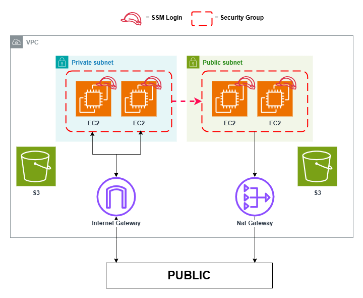

# Terraform Project Setup Guide

This guide outlines the steps to configure and deploy Terraform scripts for creating your AWS environment.

*Note: The commands provided are tailored for PowerShell.*
*Configuration example below: 1 VPC, 1 public subnet, 1 private subnet, and 2 EC2 instances per region. You can adjust the number of resources as needed by modifying the variables in `terraform.tfvars`.*




## Prerequisites

Ensure the following tools are installed on your system:
- Terraform
- AWS CLI

## Steps

1. **Navigate to the Production Directory**
    ```bash
    cd ./prod/
    ```

2. **Set AWS Configuration**
   - Configure your AWS CLI with the appropriate credentials.
   - Update the `provider.tf` file with the correct AWS account details.

3. **Prepare Terraform Files**
    - **`provider.tf`**: Specify the AWS provider configuration.
    - **`main.tf`**: Define the resources and modules to be deployed.
    - **`terraform.tfvars`**: Provide variable values required by your Terraform scripts. Example:
    ```hcl
        # BASIC
        region = "ap-northeast-2"
        tags   = { Name = "max-test" }
        # S3
        bucket_count = 2
        #VPC
        vpc_count            = 2
        vpc_cidr             = ["10.0.0.0/16", "10.1.0.0/16"]
        public_subnet_count  = 2
        private_subnet_count = 2
        availability_zones   = ["a", "b"]
        # ec2
        ec2_count     = 1
        instance_type = "t3.micro"
        os_type       = "linux" # linux, windows, mac
    ```

4. **Initialize and Apply Terraform Configuration**
    ```bash
    terraform init
    terraform validate
    terraform plan
    terraform apply -auto-approve
    ```

5. **Optional: Destroy Terraform Resources**
    ```bash
    terraform destroy -auto-approve
    ```

## Notes
- Review and customize the Terraform files (`provider.tf`, `main.tf`, `terraform.tfvars`) to match your specific requirements before applying the configuration.
- Always run `terraform validate` and `terraform plan` to verify your changes before applying them to avoid unexpected outcomes.

By following these instructions, you can efficiently set up and manage your AWS infrastructure using Terraform.


